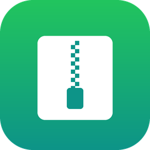
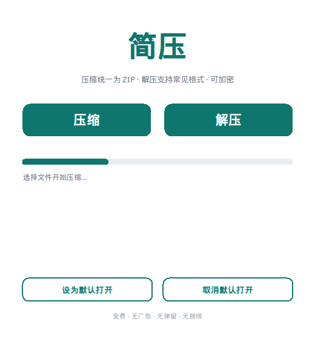
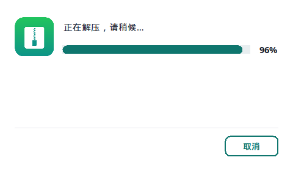
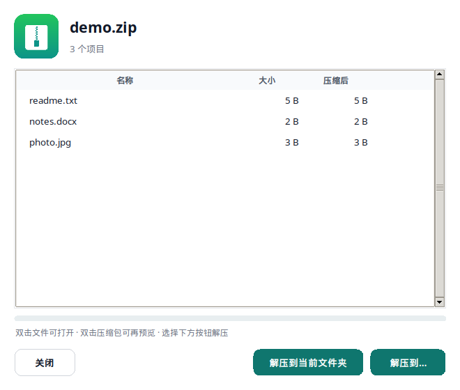
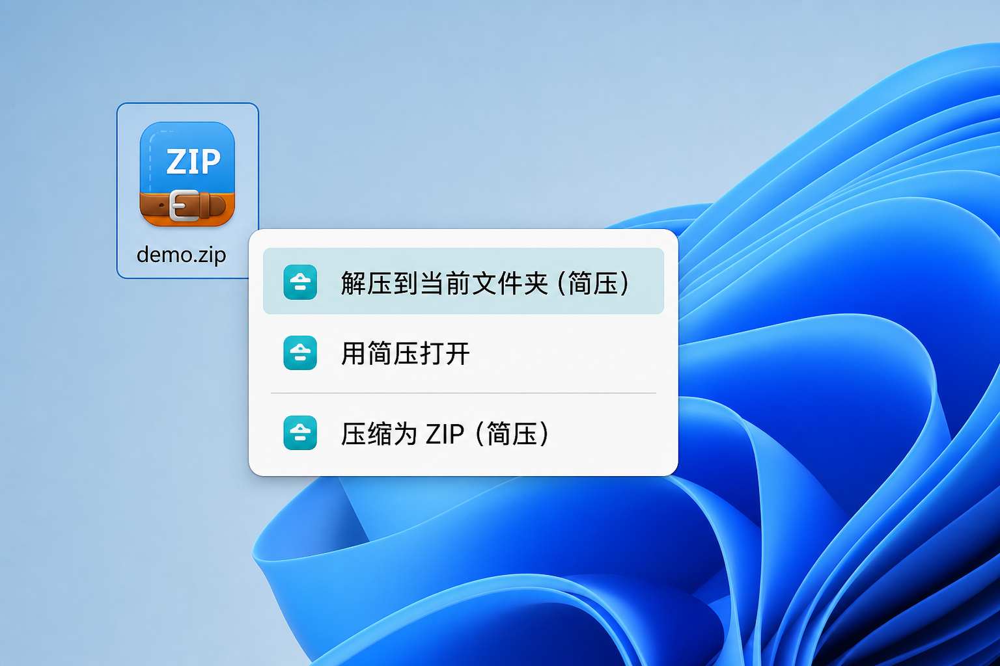

# 简压（Jianya）

<p align="center">
  
</p>

<p align="center">
  <b>免费 · 简洁 · 无广告 · 无弹窗 · 无捆绑</b><br/>
  一款真正轻量的 Windows 压缩 / 解压工具
</p>

<p align="center">
  <b>双击即可解压</b>　·　<b>右击可选打开 / 解压 / 压缩</b>
</p>

<p align="center">
  <a href="release/简压安装程序.exe"><b>⬇ 下载安装程序</b></a>
  ·
  当前版本 <b>1.1.14</b>
</p>

---

## 为什么选简压？

| 你可能受够了… | 简压这样做 |
| --- | --- |
| 安装捆绑、弹窗广告、后台更新 | **零广告、零弹窗、零捆绑** |
| 界面复杂、功能堆砌 | **主界面只有「压缩」「解压」两个大按钮** |
| 双击压缩包还要再点一次才解压 | **设为默认后，双击即可直接解压** |
| 右键菜单找不到入口 | **右击可选：打开 / 解压 / 压缩** |
| 解压套两层目录、覆盖搞不清 | **新建与压缩包同名的文件夹；已存在则自动 `demo (1)`** |

---

## 核心用法（先看这个）

安装后打开简压，点击底部 **「设为默认打开」**，即可在资源管理器中这样用：

| 操作 | 效果 |
| --- | --- |
| **双击**压缩包 | **直接解压**到当前文件夹下的同名目录（如 `demo.zip` → `demo/`；冲突则自动 `demo (1)`） |
| **右击**压缩包 | 可选 **打开**（预览内容）、**解压到当前文件夹** |
| **右击**文件 / 文件夹 | 可选 **压缩为 ZIP（简压）** |
| 主界面「压缩 / 解压」 | 图形向导选择路径，压缩时可加密 |

> **记住三句话**：双击也解压；右击可选打开或解压；右击普通文件/文件夹可压缩。

---

## 界面截图

### 主界面



极简主窗口：压缩、解压，以及「设为默认打开」。

### 解压进度



进度与完成提示使用同一尺寸弹窗，避免闪烁、黑边。

### 预览窗口（右击「打开」）



可浏览压缩包内容；列表中双击文件可用系统程序打开，嵌套压缩包可再开一层预览。

### 右键菜单



右击压缩包可选：**解压到当前文件夹**、**用简压打开**；右击普通文件/文件夹可 **压缩为 ZIP**。

---

## 特点与优势

- **极简界面**：主界面只有「压缩」「解压」，零学习成本。
- **双击即解压**：设为默认打开后，双击压缩包直接解压（无需先开预览再点按钮）。
- **右击更灵活**：压缩包可 **打开 / 解压**；文件与文件夹可 **压缩为 ZIP**。
- **压缩统一 ZIP**：输出最通用的 zip；可选 **AES-256 密码加密**。
- **解压多格式**：`zip` / `7z` / `rar` / `tar` / `tar.gz` / `tgz` / `tar.bz2` / `tar.xz` / `gz` / `bz2` / `xz`。
- **智能目录**：解压时新建与压缩包同名的文件夹再放入内容；包内根目录与压缩包同名时不套两层；再次解压自动 ` (1)` / ` (2)`。
- **预览与打开**：右击「打开」可预览；预览内双击文件打开，嵌套包可再预览；关闭时清理临时文件。
- **密码支持**：加密压缩；解压加密 zip / 7z / rar 时自动提示密码。
- **默认打开 + 图标**：zip/7z/rar 等显示简压图标，资源管理器一眼可辨。
- **纯净安全**：无广告、无后台更新；解压防 Zip Slip 路径穿越。
- **免管理员**：关联与右键写入当前用户注册表，普通权限即可。

---

## 下载 / 安装

简压为 **安装版**（非便携）。

- **安装包**：[`release/简压安装程序.exe`](release/)
- 默认安装到 `%LocalAppData%\Programs\简压`（当前用户，无需管理员）
- 安装时可勾选：注册右键菜单，并设为压缩包默认打开程序
- **卸载**：系统「设置 → 应用」或开始菜单「卸载 简压」，会清理关联与右键

安装后建议打开简压，再点一次底部 **「设为默认打开」**，确保双击解压与右键菜单生效。

> 若个别格式仍被其它软件占用，请到 **设置 → 应用 → 默认应用 → 按文件类型** 将对应扩展名改为「简压」。

---

## 使用方式

### 图形界面

```bash
python main.py
```

或安装后从开始菜单 / 桌面启动。

### 命令行（右键菜单底层同样调用）

```bash
python main.py --compress <文件或目录...>    # 压缩为 zip
python main.py --compress <路径...> -p 密码  # 加密压缩
python main.py --extract  <压缩包>           # 解压（双击默认关联）
python main.py --extract  <压缩包> -p 密码   # 解压加密包
python main.py --open <压缩包>               # 打开预览（右击「打开」）
python main.py <压缩包>                      # 默认打开行为
python main.py --install                     # 设为默认 + 注册右键
python main.py --uninstall                   # 取消默认 + 移除右键
```

### 自行打包（Windows）

```bash
pip install pyinstaller py7zr rarfile pyzipper
python build_windows.py
"C:\Program Files (x86)\Inno Setup 6\ISCC.exe" installer\jianya.iss
```

产物：`release\简压安装程序.exe`。

### Linux / 云端（Wine）

```bash
bash .cursor/install.sh
bash scripts/build_windows_wine.sh
```

---

## 开发与测试

```bash
pip install -r requirements.txt pytest
python -m pytest
```

---

## 目录结构

```
.
├── main.py
├── build_windows.py
├── assets/
│   ├── app.ico / app.png
│   └── screenshots/          # README 截图
├── vendor/UnRAR.exe
├── installer/jianya.iss
├── release/简压安装程序.exe
├── src/jianya/
│   ├── core.py               # 压缩 / 解压 / 预览 / 加密
│   ├── gui.py                # 图形界面
│   ├── cli.py
│   ├── dialogs.py            # 进度与完成提示
│   └── context_menu.py       # 文件关联 + 右键
└── tests/
```

---

## 许可

免费使用。UnRAR 工具版权归 Alexander Roshal 所有，按其许可随软件分发。
