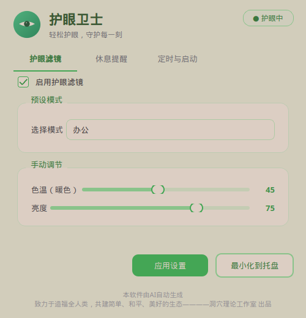
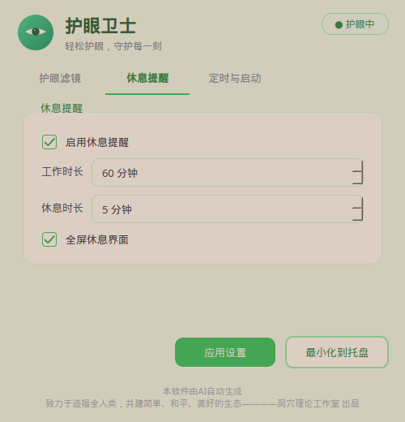
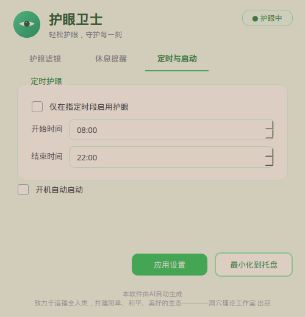

# 护眼卫士

轻松护眼，守护每一刻。

一款面向 Windows / Linux 的全局护眼软件：滤蓝光、调亮度、休息提醒、定时护眼，常驻系统托盘，关闭窗口也不会退出。

<p align="center">
  
</p>

## 功能亮点

| 功能 | 说明 |
|------|------|
| 全局护眼滤镜 | Windows 通过伽马曲线作用于整屏输出，菜单、预览窗、任务栏弹窗一并护眼 |
| 色温 / 亮度 | 0–100 实时调节，暖色滤蓝光，降低刺眼感 |
| 预设模式 | 健康、办公、阅读、夜间、影院，一键切换 |
| 休息提醒 | 可设工作/休息时长，支持多屏全屏休息界面 |
| 定时护眼 | 仅在指定时段自动启用 |
| 托盘常驻 | 关闭主界面后继续后台运行，右键托盘可退出 |

## 界面预览

### 护眼滤镜

调节色温与亮度，切换预设模式，随时开关护眼。


### 休息提醒

设置工作与休息时长，到点全屏提醒你远眺放松。



### 定时与启动

按时间段自动启用护眼，可选开机自启。



## 快速开始

### Windows

1. 打开 [`release/护眼卫士.exe`](release/护眼卫士.exe) 下载
2. 双击运行，首次会显示主界面
3. 点击「最小化到托盘」或关闭窗口后，程序常驻系统托盘
4. 双击托盘图标可再次打开主界面；右键选择「退出程序」可完全退出

### Linux

```bash
chmod +x run.sh
./run.sh
```

可选安装到系统：

```bash
chmod +x install.sh
./install.sh
# 之后可用命令 eye-care 启动
```

## 使用说明

1. **启动** — 打开程序，主界面自动出现
2. **调节护眼** — 在「护眼滤镜」中拖动色温、亮度，或选择预设
3. **应用设置** — 点击「应用设置」保存
4. **托盘常驻** — 关闭窗口后继续护眼；双击托盘图标重新打开
5. **休息提醒** — 在「休息提醒」中设置工作/休息时长
6. **退出** — 仅能通过托盘右键「退出程序」关闭

## 预设模式

| 模式 | 色温 | 亮度 | 适用场景 |
|------|------|------|----------|
| 健康 | 25 | 85 | 日常轻度护眼 |
| 办公 | 45 | 75 | 长时间办公 |
| 阅读 | 60 | 65 | 阅读文档 |
| 夜间 | 85 | 45 | 夜间强滤蓝光 |
| 影院 | 70 | 55 | 观影娱乐 |

## 技术说明

**Windows**：使用显卡伽马曲线（Gamma Ramp）调节整屏色温与亮度，覆盖右键菜单、Alt+Tab 预览、开始菜单等系统 UI；若不支持则自动回退全屏遮罩。

**Linux**：在每个显示器上创建置顶、鼠标穿透的透明遮罩窗口实现护眼效果。

配置文件：

- Windows：`%APPDATA%\EyeCare\config.json`
- Linux：`~/.config/eye-care/config.json`

## 自行打包（Windows）

```bat
build-windows.bat
```

或由 GitHub Actions 自动构建，产物输出到 `release/护眼卫士.exe`。

## 项目结构

```
.
├── release/护眼卫士.exe   # Windows 发布包
├── docs/screenshots/     # 界面截图
├── src/                  # 源代码
├── assets/               # 图标与资源
├── run.sh                # Linux 启动
├── install.sh            # Linux 安装
└── build-windows.bat     # Windows 打包
```

## 许可证

本项目采用 [GPL-3.0](LICENSE) 发布（与 PyQt6 依赖一致）。第三方说明见 [THIRD_PARTY_NOTICES.md](THIRD_PARTY_NOTICES.md)。

---

本软件由 AI 自动生成  
致力于造福全人类，共建简单、和平、美好的生态————洞穴理论工作室 出品
